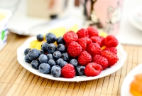
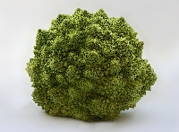

# Getting started

## Introduction

### Motivation: Why create yet another R package

Over the last decades, the amount of data generated is growing rapidly,
predominantly due to digitalization. Most of today’s data is
unstructured, and this share is increasing. Given that unstructured data
is rich, these data could provide rich insights for scientific research
from a variety of fields and practice alike. Especially images (i.e.,
visual stimuli) are recognized as valuable source of information.

At the same time, vision research and research in psychology shows that
even simple changes in low-level image features (like symmetry,
contrast, or complexity) can have a tremendous effect on a variety of
human judgments. As an example, a statement like “Nut bread is healthier
than potato bread” is more likely to be perceived as true when presented
in a color that is easy to read against a white background (high
contrast) instead of being presented in a color that is difficult to
read against a white background (low contrast; cf.
\[[1](#ref-Hansen2008)\]). Thus, it might be useful to estimate and
control for differences in such low-level visual features in any
research that includes visual stimuli.

**imagefluency** is an `R` package for such low-level image scores based
on processing fluency theory. The package allows to get scores for
several basic aesthetic principles that facilitate fluent cognitive
processing of images: contrast, complexity / simplicity,
self-similarity, symmetry, and typicality.

### Why and when to use the package

Possible applications include:

- stimulus selection in experiments (e.g., testing brand logos, evaluate
  product designs, online display ads)
- as control variables in statistical or prediction models
- linking image fluency scores to outcomes of interest (e.g., how should
  a typical product packaging look like, do simpler images get more or
  less attention on a website, …)
- (interpretable) image features in simple machine learning models,
  e.g. SVM image classifier

## Theoretical background

The most prevailing explanation for how low-level image features affect
human judgments is based on processing fluency theory
\[[2](#ref-Reber2004)\]. Processing fluency describes the ease of
processing a stimulus \[[3](#ref-Schwarz2004)\], which happens
instantaneously and automatically \[[4](#ref-Graf2015)\]. Higher
processing fluency results in a gut-level positive affective response
\[[5](#ref-Winkielman2001)\]. Notably, a rich body of literature has
shown that processing fluency effects have an impact on a variety of
judgmental domains in our everyday life, including how much we like
things, how much we consider statements to be true, how trustworthy we
judge a person, how risky we think something is, or whether we buy a
product or not (for a review, see \[[6](#ref-Alter2009)\]).

Several stimulus features have been proposed that result in increased
fluency. In particular, visual symmetry, simplicity, (proto-)typicality,
and contrast were identified to facilitate processing
\[[2](#ref-Reber2004)\]. Recent studies further discuss self-similarity
in light of fluency-based aesthetics \[[7](#ref-Joye2016),
[8](#ref-MayerPACA2018)\], a concept which has been studied for example
in images of natural scenes \[[9](#ref-Simoncelli2003)\].
Self-similarity can be described as self-repeating patterns within a
stimulus. A typical example are the leaves of ferns that feature the
same shape regardless of any magnification or reduction (i.e., scale
invariance). Another prominent example is romanesco broccoli with its
self-similar surface.

Extracting image features for contrast, self-similarity, simplicity,
symmetry, and typicality therefore constitute the core purpose of the
`imagefluency` package.

## Package overview

### Main functions

- [`img_contrast()`](https://imagefluency.com/reference/img_contrast.md)
  visual contrast of an image
- [`img_complexity()`](https://imagefluency.com/reference/img_complexity.md)
  visual complexity of an image (opposite of simplicity)
- [`img_self_similarity()`](https://imagefluency.com/reference/img_self_similarity.md)
  visual self-similarity of an image
- [`img_simplicity()`](https://imagefluency.com/reference/img_simplicity.md)
  visual simplicity of an image (opposite of complexity)
- [`img_symmetry()`](https://imagefluency.com/reference/img_symmetry.md)
  vertical and horizontal symmetry of an image
- [`img_typicality()`](https://imagefluency.com/reference/img_typicality.md)
  visual typicality of a list of images relative to each other

### Other helpful functions

- [`img_read()`](https://imagefluency.com/reference/img_read.md) reads
  bitmap images into R
- [`rgb2gray()`](https://imagefluency.com/reference/rgb2gray.md)
  converts images from RGB into grayscale (might speed up computation)
- [`run_imagefluency()`](https://imagefluency.com/reference/run_imagefluency.md)
  to launch a Shiny app locally on your computer for an interactive demo
  of the main functions (alternatively, visit the online version at
  [posit.cloud](https://019d45ea-53cc-6381-9ecf-5151194cda1f.share.connect.posit.cloud/))

### Installation

You can install the current stable version from CRAN.

``` r
install.packages('imagefluency')
```

To download the latest development version from Github use the
`install_github` function of the `remotes` package.

``` r
# install remotes if necessary
if (!require('remotes')) install.packages('remotes')
# install imagefluency from github
remotes::install_github('stm/imagefluency')
```

After installation, the `imagefluency` package is loaded the usual way
by calling [`library(imagefluency)`](https://imagefluency.com). The
[`img_read()`](https://imagefluency.com/reference/img_read.md) function
can be used to read an image into R. Just like with reading in a
dataset, [`img_read()`](https://imagefluency.com/reference/img_read.md)
expects the path to the file as input, e.g.,
`img_read('C:/Users/myname/Documents/myimage.jpg')`. Currently supported
file formats are bmp, jpg, png, and tif.

Use the following link to report bugs/issues:
<https://github.com/stm/imagefluency/issues>

## Using imagefluency

`imagefluency` allows to get scores for five image features that
facilitate fluent processing of images: contrast, complexity /
simplicity, self-similarity, symmetry, and typicality.

To use the imagefluency package, first load the library.

``` r
library(imagefluency)
```

### Contrast

The function
[`img_contrast()`](https://imagefluency.com/reference/img_contrast.md)
returns the contrast of an image. Most research defines contrast in
images as the root-mean-squared (RMS) contrast which is the standard
deviation of the normalized pixel intensity values
\[[10](#ref-Peli1990)\]:
$\sqrt{\frac{1}{MN}\sum_{i = 0}^{N - 1}\sum_{j = 0}^{M - 1}\left( I_{ij} - \bar{I} \right)^{2}}$.
The RMS of an image as a measure for visual contrast has been shown to
predict human contrast detection thresholds well
\[[11](#ref-Frazor2006)\]. Therefore, the function calculates contrast
by computing the RMS contrast of the input image. Consequently, a higher
value indicates higher contrast. The image is normalized if necessary
(i.e., normalization into range \[0, 1\]). For color images, a weighted
average between color the channels is computed (cf.
\[[8](#ref-MayerPACA2018)\]).

Note that in the following, example images that come with the package
are used. Moreover, the images can be displayed using the
`grid.raster()` function from the `grid` package.

``` r
# Example image with relatively high contrast: berries
berries <- img_read(system.file('example_images', 'berries.jpg', package = 'imagefluency'))
# display image
grid::grid.raster(berries)
# get contrast
img_contrast(berries)
```

``` r
# Example image with relatively low contrast: bike
bike <- img_read(system.file('example_images', 'bike.jpg', package = 'imagefluency'))
# display image
grid::grid.raster(bike)
# get contrast
img_contrast(bike)
```

Calculating the contrast scores for the two images gives the following
result:


score: 0.08



score: 0.29

### Complexity / Simplicity

The function
[`img_complexity()`](https://imagefluency.com/reference/img_complexity.md)
returns the visual complexity of an image. Algorithmic information
theory indicates that picture complexity can be measured accurately by
image compression rates because complex images are denser and have fewer
redundancies \[[12](#ref-Donderi2006), [13](#ref-Landwehr2011)\].
Therefore, the function calculates the visual complexity of an image as
the ratio between the compressed and uncompressed image file size. Thus,
the value does not depend on image size.

The function takes the file path of an image file (or URL) or a
pre-loaded image as input argument and returns the ratio of the
compressed divided by the uncompressed image file size. The complexity
values are naturally interpretable and can range between almost 0
(virtually completely compressed image, thus extremely simple image) and
1 (no compression possible, thus extremely complex image). The function
offers to use different image compression algorithms like `jpg`, `gif`,
or `png` with `algorithm = 'zip'` as default (for a discussion about the
different algorithms, see \[[8](#ref-MayerPACA2018)\]).

As most compression algorithms do not depict horizontal and vertical
redundancies equally, the function includes an optional `rotate`
parameter (default: `FALSE`). Setting this parameter to `TRUE`
additionally creates a compressed version of the *rotated* image. The
overall compressed image’s file size is computed as the minimum of the
original image’s file size and the file size of the rotated image.

The function
[`img_simplicity()`](https://imagefluency.com/reference/img_simplicity.md)
returns the visual simplicity of an image. Image simplicity is the
complement to image complexity and therefore calculated as 1 minus the
complexity score (i.e., the compression rate). Values can range between
0 (no compression possible, thus extremely complex image) and almost 1
(virtually completely compressed image, thus extremely simple image).

``` r
# Example image with high complexity: trees
trees <- img_read(system.file('example_images', 'trees.jpg', package = 'imagefluency'))
# display image
grid::grid.raster(trees)
# get complexity
img_complexity(trees)
```

``` r
# Example image with low complexity: sky
sky <- img_read(system.file('example_images', 'sky.jpg', package = 'imagefluency'))
# display image
grid::grid.raster(sky)
# get complexity
img_complexity(sky)
```

Calculating the complexity scores for the two images gives the following
result:


score: 0.89


score: 0.42

### Self-similarity

The function
[`img_self_similarity()`](https://imagefluency.com/reference/img_self_similarity.md)
returns the self-similarity of an image. Self-similarity can be measured
with the Fourier power spectrum of an image. Previous research has
identified that the spectral power of natural scenes falls with spatial
frequencies ($f$) according to a power law ($\frac{1}{f^{p}}$) with
values of $p$ near the value 2, which indicates scale invariance (for a
review, see \[[14](#ref-Simoncelli2001)\]). Therefore, the function
computes self-similarity via the slope of the log-log power spectrum of
the image using OLS.

The value for self-similarity that is returned by the function is
calculated as
$\text{self-similarity} = \left| \text{slope} + 2 \right|*( - 1)$. That
is, the measure reaches its maximum value of 0 for a slope of $- 2$, and
any deviation from $- 2$ results in negative values that are more
negative the higher the deviation from $- 2$. Thus, the range of the
self-similarity scores is $- \infty$ to $0$. For color images, the
weighted average between each color channel’s values is computed.

It is possible to get the raw regression slope (instead of the
transformed value which indicates self-similarity) by using the option
`raw = TRUE`. More options include the possibility to plot the log-log
power spectrum (`logplot = TRUE`) and to base the computation of the
slope on the full frequency spectrum (`full = TRUE`). See the function’s
help file for details (i.e.,
[`?img_self_similarity`](https://imagefluency.com/reference/img_self_similarity.md)).

``` r
# Example image with high self-similarity: romanesco
romanesco <- img_read(system.file('example_images', 'romanesco.jpg', package = 'imagefluency'))
# display image
grid::grid.raster(romanesco)
# get self-similarity
img_self_similarity(romanesco)
```

``` r
# Example image with low self-similarity: office
office <- img_read(system.file('example_images', 'office.jpg', package = 'imagefluency'))
# display image
grid::grid.raster(office)
# get self-similarity
img_self_similarity(office)
```

Calculating the self-similarity scores for the two images gives the
result below. The score for the romanesco broccoli is much closer to the
maximum possible value of 0, hence much more self-similar.



score: -0.03


score: -1.22

### Symmetry

The function
[`img_symmetry()`](https://imagefluency.com/reference/img_symmetry.md)
returns the vertical and horizontal symmetry of an image as a numeric
value between 0 (not symmetrical) and 1 (perfectly symmetrical).

Symmetry is computed as the correlation of corresponding image halves
(i.e., the pairwise correlation of the corresponding pixels, cf.
\[[15](#ref-Mayer2014)\]). As the perceptual mirror axis is not
necessarily exactly in the middle of a picture, the function detects in
a first step the ‘optimal’ mirror axis by estimating several symmetry
values with different positions for the mirror axis. To this end, the
mirror axis is automatically shifted up to 5% and to the right (in the
case of vertical symmetry; analogously for horizontal symmetry). In the
second step, the overall symmetry score is computed as the maximum of
the symmetry scores given the different mirror axes. For color images,
the weighted average between each color channel’s values is computed.
See \[[8](#ref-MayerPACA2018)\] for details.

The function further has two optional logical parameters: `vertical` and
`horizontal` (both `TRUE` by default). If one of the parameter is set to
`FALSE`, the vertical or horizontal symmetry is not computed,
respectively. See the function’s help file (i.e.,
[`?img_symmetry`](https://imagefluency.com/reference/img_symmetry.md))
for information about the additional options `shift_range` and
`per_channel`.

``` r
# Example image with high vertical symmetry: rails
rails <- img_read(system.file('example_images', 'rails.jpg', package = 'imagefluency'))
# display image
grid::grid.raster(rails)
# get only vertical symmetry
img_symmetry(rails, horizontal = FALSE)
```

``` r
# Example image with low vertical symmetry: bridge
bridge <- img_read(system.file('example_images', 'bridge.jpg', package = 'imagefluency'))
# display image
grid::grid.raster(bridge)
# get only vertical symmetry
img_symmetry(bridge, horizontal = FALSE)
```

Calculating the vertical symmetry scores for the two images gives the
following result:


score: 0.96


score: 0.48

### Image typicality

The function
[`img_typicality()`](https://imagefluency.com/reference/img_typicality.md)
returns the visual typicality of a *set* of images relative to each
other. Values can range between -1 (inversely typical) over 0 (not
typical) to 1 (perfectly typical). That is, higher absolute values
indicate a larger typicality.

The typicality score is computed as the correlation of a particular
image with the average representation of all images, i.e., the mean of
all images \[[16](#ref-Perrett1994)\]. That is, the typicality of an
image can not be assessed in isolation, but only in comparison to set of
images from the same category.

For color images, the weighted average between each color channel’s
values is computed. If the images have different dimensions they are
automatically resized to the smallest height and width. Rescaling of the
images prior to computing the typicality scores can be specified with
the optional rescaling parameter (must be a numeric value). With
rescaling it is possible to assess typicality at different perceptual
levels (see \[[17](#ref-MayerDS2018)\] for details). Most users won’t
need any rescaling and can use the default (`rescale = NULL`).

The following example shows three images of which two depict valleys in
the mountains and one depicts fireworks. Therefore, the fireworks image
is in comparison rather low in typicality in this set of images (i.e.,
atypical). It is important to note that an image’s typicality score
highly depends on the reference set to which the image is compared to.

``` r
# Example images depicting valleys: valley_white, valley_green
# Example image depicting fireworks: fireworks
valley_white <- img_read(system.file('example_images', 'valley_white.jpg', package = 'imagefluency'))
valley_green <- img_read(system.file('example_images', 'valley_green.jpg', package = 'imagefluency'))
fireworks <- img_read(system.file('example_images', 'fireworks.jpg', package = 'imagefluency'))

# create image set as list
imglist <- list(valley_white, fireworks, valley_green)

# get typicality
img_typicality(imglist)
```

Calculating the typicality scores for the three images gives the
following result:


score: 0.75


score: 0.40


score: 0.72

## Summary

`imagefluency` is an simple `R` package for image fluency scores. The
package allows to get scores for several basic aesthetic principles that
facilitate fluent cognitive processing of images. It straightforward to
use and allows for an easy conversion of unstructured data into
structured image features. These structured image features are naturally
interpretable (i.e., no black-box-model). Finally, including such image
information in statistical models might increase a model’s statistical
and predictive power.

## References

1\.

Hansen, J., Dechêne, A., & Wänke, M. (2008). Discrepant fluency
increases subjective truth. *Journal of Experimental Social Psychology*,
*44*(3), 687–691. <https://doi.org/10.1016/j.jesp.2007.04.005>

2\.

Reber, R., Schwarz, N., & Winkielman, P. (2004). Processing fluency and
aesthetic pleasure: Is beauty in the perceiver’s processing experience?
*Personality and Social Psychology Review*, *8*(4), 364–382.
<https://doi.org/10.1207/s15327957pspr0804_3>

3\.

Schwarz, N. (2004). Metacognitive experiences in consumer judgment and
decision making. *Journal of Consumer Psychology*, *14*(4), 332–348.
<https://doi.org/10.1207/s15327663jcp1404_2>

4\.

Graf, L. K. M., & Landwehr, J. R. (2015). A dual-process perspective on
fluency-based aesthetics: The pleasure-interest model of aesthetic
liking. *Personality and Social Psychology Review*, *19*(4), 395–410.
<https://doi.org/10.1177/1088868315574978>

5\.

Winkielman, P., & Cacioppo, J. T. (2001). Mind at ease puts a smile on
the face: Psychophysiological evidence that processing facilitation
elicits positive affect. *Journal of Personality and Social Psychology*,
*81*(6), 989. <https://doi.org/10.1037//0022-3514.81.6.989>

6\.

Alter, A. L., & Oppenheimer, D. M. (2009). Uniting the tribes of fluency
to form a metacognitive nation. *Personality and Social Psychology
Review*, *13*(3), 219–235. <https://doi.org/10.1177/1088868309341564>

7\.

Joye, Y., Steg, L., Ünal, A. B., & Pals, R. (2016). When complex is easy
on the mind: Internal repetition of visual information in complex
objects is a source of perceptual fluency. *Journal of Experimental
Psychology: Human Perception and Performance*, *42*(1), 103–114.
<https://doi.org/10.1037/xhp0000105>

8\.

Mayer, S., & Landwehr, J. R. (2018). Quantifying visual aesthetics based
on processing fluency theory: Four algorithmic measures for antecedents
of aesthetic preferences. *Psychology of Aesthetics, Creativity, and the
Arts*, *12*(4), 399–431. <https://doi.org/10.1037/aca0000187>

9\.

Simoncelli, E. P. (2003). Vision and the statistics of the visual
environment. *Current Opinion in Neurobiology*, *13*(2), 144–149.
<https://doi.org/10.1016/S0959-4388(03)00047-3>

10\.

Peli, E. (1990). Contrast in complex images. *Journal of the Optical
Society of America A*, *7*(10), 2032–2040.
<https://doi.org/10.1364/JOSAA.7.002032>

11\.

Frazor, R. A., & Geisler, W. S. (2006). Local luminance and contrast in
natural images. *Vision Research*, *46*(10), 1585–1598.
<https://doi.org/10.1016/j.visres.2005.06.038>

12\.

Donderi, D. C. (2006). Visual complexity: A review. *Psychological
Bulletin*, *132*(1), 73–97. <https://doi.org/10.1037/0033-2909.132.1.73>

13\.

Landwehr, J. R., Labroo, A. A., & Herrmann, A. (2011). Gut liking for
the ordinary: Incorporating design fluency improves automobile sales
forecasts. *Marketing Science*, *30*(3), 416–429.
<https://doi.org/10.1287/mksc.1110.0633>

14\.

Simoncelli, E. P., & Olshausen, B. A. (2001). Natural image statistics
and neural representation. *Annual Review of Neuroscience*, *24*(1),
1193–1216. <https://doi.org/10.1146/annurev.neuro.24.1.1193>

15\.

Mayer, S., & Landwehr, J. R. (2014). When complexity is symmetric: The
interplay of two core determinants of visual aesthetics. In J. Cotte &
S. Wood (Eds.), *Advances in Consumer Research* (Vol. 42, pp. 608–609).
Duluth, MN: Association for Consumer Research.

16\.

Perrett, D. I., May, K. A., & Yoshikawa, S. (1994). Facial shape and
judgements of female attractiveness. *Nature*, *368*(6468), 239–242.
<https://doi.org/10.1038/368239a0>

17\.

Mayer, S., & Landwehr, J. R. (2018). Objective measures of design
typicality. *Design Studies*, *54*, 146–161.
<https://doi.org/10.1016/j.destud.2017.09.004>
